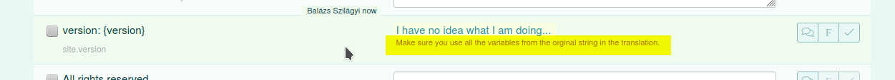
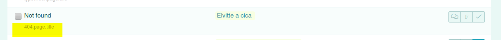
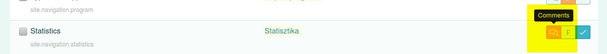

# Translation guide

## Poeditor.com howto

However the UI of the Translation manager system is quite straightforward, I like to point on the common mistakes.

-   **Do not translate placeholders**! The text in curly brackets is a variable, please keep it as it is. E.g `version: {version}` can be translated as `wersja: {version}`. `{hand} {finger}` should not be translated at all, because it only contains variables, but it can be rearranged, some languages may say it a different way, like `{finger} {hand}`.

-   Please keep in mind, that you can see the template name, which helps you to get some background what you translating.

-   Notice the comments, there are maybe useful instructions. You even can ask questions if sou have any doubt.

-   Do not response to comments, if not necessary :)

## Voice and Tone

### Audience

Basically everyone, but especially people who are open-minded and have the willingness to learn, in this case, typing. Regardless of age or anything.

### Formality

The app is informal. By communication, I often write from my perspective as "I" to the user as "you". e.g. "I like to inform you". As the app becomes open source and public, I'm thinking about moving to "we" and "us".

### Domain

The app is about **ten-finger typewriting**, so the category could be education.

## Further details

The typewriter application was written by me back then, and so it had a "specific way of communication", the "my style of explaining it". After more than 10 years it is time to make it more standard, I think it is necessary to serve the public taste. So in general, please try to use words and expressions which are nice, gentle, and friendly. Things you also like to receive if you use an app. However, certain things made this app unique, which I like to keep if possible.

### Fun

Without fun, I can not imagine good teaching and learning. Fun makes my day, and boost my motivation and stamina. But on the other hand, some people like some sort of fun, while others not, so it is hard to find the right balance. An example is the original feedback message when the user made too many errors. The user got a random sentence (it was even spoken, not just written), like "You're dumb" or similar semi-offensive sentences said funnily. I probably lost some users, but I also got feedback about how genial it is... If it goes about fun, please use a slight amount of humor if possible, a sophisticated, exotic, unique one. But don't go for the popular directions, do not try to make something funny, which doesn't have to be.

### clarity

The app should be like a game. There are no explanations for the games usually, they are mostly self-descriptive and straightforward. This should be the case with these lectures too. I try to keep the strings as lean as possible. (The longer explanations will be mainly hidden)

### Synonyms

By translating "repeating" content, like `site.keywords`, please use your imagination or a synonym dictionary. If your language does not contain as many synonyms as many exist in English, e.g. "lesson, practice, course, tutorial", please use something similar, which fits the topic, something which people may search for on your language. If you translate a "collection" like `site.keywords`, please try not to use the same word twice, rather a word which may not a right translation, but a good fit for the overall topic.

## Voice and Tone

### Audience

Basically everyone, but especially people who are open-minded and have the willingness to learn, in this case, typing. Regardless of age or anything.

### Formality

The app is informal. By communication, I often write from my perspective as "I" to the user as "you". e.g. "I like to inform you". As the app becomes open source and public, I'm thinking about moving to "we" and "us".

### Domain

The app is about **ten-finger typewriting**, so the category could be education.

## Further details

The typewriter application was written by me back then, and so it had a "specific way of communication", the "my style of explaining it". After more than 10 years it is time to make it more standard, I think it is necessary to serve the public taste. So in general, please try to use words and expressions which are nice, gentle, and friendly. Things you also like to receive if you use an app. However, certain things made this app unique, which I like to keep if possible.

### Fun

Without fun, I can not imagine good teaching and learning. Fun makes my day, and boost my motivation and stamina. But on the other hand, some people like some sort of fun, while others not, so it is hard to find the right balance. An example is the original feedback message when the user made too many errors. The user got a random sentence (it was even spoken, not just written), like "You're dumb" or similar semi-offensive sentences said funnily. I probably lost some users, but I also got feedback about how genial it is... If it goes about fun, please use a slight amount of humor if possible, a sophisticated, exotic, unique one. But don't go for the popular directions, do not try to make something funny, which doesn't have to be.

### clarity

The app should be like a game. There are no explanations for the games usually, they are mostly self-descriptive and straightforward. This should be the case with these lectures too. I try to keep the strings as lean as possible. (The longer explanations will be mainly hidden)

### Synonyms

By translating "repeating" content, like `site.keywords`, please use your imagination or a synonym dictionary. If your language does not contain as many synonyms as many exist in English, e.g. "lesson, practice, course, tutorial", please use something similar, which fits the topic, something which people may search for on your language. If you translate a "collection" like `site.keywords`, please try not to use the same word twice, rather a word which may not a right translation, but a good fit for the overall topic.
